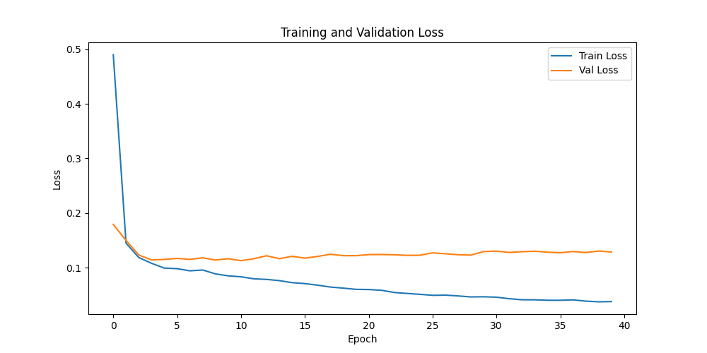

# License Plate Recognition with Unet++

This project implements a **license plate recognition system** using a **Unet++** network for image segmentation.

## Repository Contents

- `train.py` - Script to train the model on local datasets.  
- `train_colab.py` - Colab-optimized training script.  
- `inference_ds.py` - Script for running inference on a dataset of images.  
- `unetpp_*.pth` - Pre-trained PyTorch models.  
- `loss_curve.png` - Training loss graph.  
- `output/` - Folder to save the model's output images.  

## Requirements

- Python 3.8+  
- PyTorch  
- OpenCV  
- NumPy  
- Albumentations (for data augmentations)  

You can install the dependencies using:

```bash
pip install -r requirements.txt
```

## Usage

1. **Training the Model**  
   To train the model on your local machine, run:
   ```bash
   python train.py
   ```

2. **Dataset Inference**

    To run inference on a dataset of images, use:
    ```bash
    python inference_ds.py
    ```

## Pre-trained Models

Pre-trained models are available in the repository. You can use them directly for inference or as a starting point for further training.

## Results

The model achieves high accuracy in segmenting license plates from images. Below is the loss curve from training:



